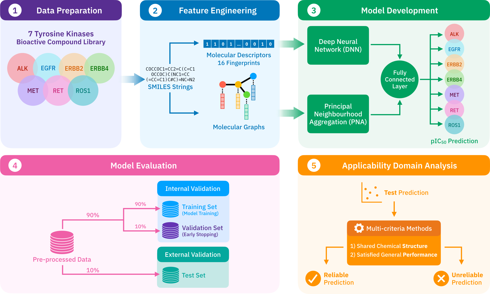

# Multibind-RTKs
Assisting Multi-Targeted Ligand Affinity Prediction of Receptor Tyrosine Kinases Associated Non-Small Cell Lung Cancer Treatment with Multitasking Principal Neighbourhood Aggregation

Fahsai Nakarin,<sup>1,‡,*</sup>Kajjana Boonpalit,<sup>1,‡</sup>Jiramet Kinchagawat,<sup>1</sup>Patcharapol Wachiraphan,<sup>1</sup>Thanyada Rungrotmongkol,<sup>2,3</sup> and Sarana Nutanong<sup>1</sup>

1 School of Information Science and Technology, Vidyasirimedhi Institute of Science and Technology (VISTEC), Rayong 21210, Thailand

2 Biocatalyst and Environmental Biotechnology Research Unit, Department of Biochemistry, Faculty of Science, Chulalongkorn University, Bangkok 10330, Thailand

3 Program in Bioinformatics and Computational Biology, Graduate School, Chulalongkorn University, Bangkok 10330, Thailand

‡ Contributed equally to this work

## About
A multi-targeted therapeutic approach with hybrid drugs is a promising strategy to enhance anticancer efficiency and overcome drug resistance in non-small cell lung cancer (NSCLC) treatment. Estimating affinities of small molecules against targets of interest typically proceeds as a preliminary action for recent drug discovery in the pharmaceutical industry. In this investigation, we employed machine-learning models to provide a computationally affordable means for computer-aided screening to accelerate the discovery of potential drug compounds. In particular, we introduced a quantitative structure-activity relationship (QSAR) based multitask learning model to facilitate an in-silico screening system of multi-targeted drug development. Our method combines a recently developed graph-based neural network architecture, Principal Neighbourhood Aggregation (PNA), with a descriptor-based deep neural network supporting synergistic utilization of molecular graph and fingerprint features. The model was generated by more than ten-thousands affinity-reported ligands of 7 crucial receptor tyrosine kinases in NSCLC from two public data sources, maximizing our model’s generality with various characteristics in the data set. As a result, our multitask model demonstrated better performance than all other benchmark models, as well as achieving satisfying predictive ability regarding applicable QSAR criteria for most tasks within the model’s applicability. Since our model could potentially be a screening tool for practical use, we have provided a model-implementation platform with a tutorial which is freely accessible via https://github.com/kajjana/Multibind-RTKs, hence, advising the first move in a long journey of cancer drug development.



## Prerequisites

Prerequisite libraries are listed 
1) [scikit-learn](http://scikit-learn.org/stable/)
2) [RDKit](https://www.rdkit.org/docs/Install.html)
3) [PyTorch](http://pytorch.org)
4) [Pytorch-Geometric](https://pytorch-geometric.readthedocs.io/en/latest/notes/installation.html)
5) [jpype1](https://jpype.readthedocs.io/en/devel/install.html)
6) [openbabel](https://openbabel.org/docs/dev/Installation/install.html#install-binaries)

## Usage
### Screening 
Prepare the csv file containing index and 'smiles' column of screening molecules. The smiles must have desalted via data preprocessing processes. In this case, we use sample.csv as a sample dataset.


| | smiles
------------ | -------------
0 | O=C(Nc1ccc(Oc2ccnc3cc(-c4ccc(CN5CCNCC5)cc4)sc23)c(F)c1)N1CCN(c2ccccc2)C1=O
1 | C=CC(=O)N1CCC[C@@H](Oc2nc(Nc3ccc(N4CCC(N5CCN(C)CC5)CC4)c(C)c3)c(C(N)=O)nc2CC)C1
2 | CN[C@@H]1C[C@H]2O[C@@](C)([C@@H]1OC)n1c3ccccc3c3c4c(c5c6ccccc6n2c5c31)C(=O)NC4
3 | Cc1cccc(Nc2ncnc3ccc(Br)cc23)c1

The structure of the `root_dir` should be:
```
root_dir
├── get_fp.py
├── featurized_screen.py
├── predict-ad.py
├── sample.csv (screening dataset)
├── cdk-2.3.jar
│ 
├── PCA_FP
├── X
├── Model
│   ├── prepca.model 
│   ├── deg_pretrain.pkl  
│   └── pretrain.model
├── AD
│   ├── train_for_AD.csv 
│   └── CVprediction_for_AD.csv
└── Results
```
Generate 16 Fingerprints from ```sample.csv``` , then concatenate and save it to ```sample_FP.csv```. 

```bash
python get_fp.py sample.csv sample_FP.csv
```

Select dataset file and its fingerprint file, pca model, and assign task as 'Screen'. The dimensional reduction via PCA will perform on fingerprint by ```prepca.model```.
The graph and pca fingerprint feature of the selected dataset will be loaded to ```sample.pkl```.
The ```sample_PCA16FPs.csv``` will be collected in ```PCA_FP``` folder and ```sample.pkl``` will be collected in ```X``` folder.

```bash
python featurized.py sample.csv sample_FP.csv prepca.model Screen
```
Use ```pretrain.model``` to predict pIC50 of selected dataset .

```bash
python predict-ad.py pretrain.model sample.pkl AD
```
The ```Result_sample.csv``` that contain the predicted values will be collected in ```Results``` folder. The applicability domain (AD) analysis will be performed automatically.

The output will be as following
||smiles|predicted_pIC50_erbB4|predicted_pIC50_egfr|predicted_pIC50_met|predicted_pIC50_alk|predicted_pIC50_erbB2|predicted_pIC50_ret|predicted_pIC50_ros1|erbB4_domain|egfr_domain|met_domain|alk_domain|erbB2_domain|ret_domain|ros1_domain
------------ |------------ |------------ |------------ |------------ |------------ |------------ |------------ |------------ |------------ |------------ |------------ |------------ |------------ |------------ |------------
0|O=C(Nc1ccc(Oc2ccnc3cc(-c4ccc(CN5CCNCC5)cc4)sc23)c(F)c1)N1CCN(c2ccccc2)C1=O	|7.26	|7.21|	7.52	|7.21	|6.94	|7.56	|7.62|	outside	|outside	|inside	|outside|	outside|	outside|	outside
1|C=CC(=O)N1CCC[C@@H](Oc2nc(Nc3ccc(N4CCC(N5CCN(C)CC5)CC4)c(C)c3)c(C(N)=O)nc2CC)C1|	8.04	|8.79	|7.5	|8.12|	7.55|	7.58	|8.85	|outside	|inside	|outside|	inside|	outside|	inside	|inside
2|CN[C@@H]1C[C@H]2O[C@@](C)([C@@H]1OC)n1c3ccccc3c3c4c(c5c6ccccc6n2c5c31)C(=O)NC4	|8.13|	7.95|	7.33	|9.61|	7.84	|10.07	|11.19	|outside|	inside|	outside|	outside|	inside	|outside	|outside
3|Cc1cccc(Nc2ncnc3ccc(Br)cc23)c1|	6.87	|6.49|	7.36|	5.99	|5.8	|6.27|	6.87	|inside	|inside	|outside|	outside	|outside	|outside	|outside

### Custom Model Training 
Prepare the csv file containing 9 columns consist of index, 'smiles', 'pIC50_erbB4',	'pIC50_egfr',	'pIC50_met',	'pIC50_alk',	'pIC50_erbB2',	'pIC50_ret', and	'pIC50_ros1'.
of molecules respectively. The smiles must have desalted via data preprocessing processes.

| | smiles | pIC50_erbB4|pIC50_egfr|pIC50_met|pIC50_alk|pIC50_erbB2|pIC50_ret|pIC50_ros1
------------ | ------------- | -------------| -------------| -------------| -------------| -------------| -------------| -------------
0 |CS(=O)(=O)CCNCCCCOc1ccc2ncnc(Nc3ccc(F)c(Cl)c3)c2c1|		|7.7|			| |6.68| | 	
1	|O=C(Nc1ccc(Oc2ccnc3cc(-c4ccc(CN5CCNCC5)cc4)sc23)c(F)c1)N1CCN(c2ccccc2)C1=O|			7.66		|		| | | | | 
2	|C=CC(=O)N1CCC[C@@H](Oc2nc(Nc3ccc(N4CCC(N5CCN(C)CC5)CC4)c(C)c3)c(C(N)=O)nc2CC)C1|		|8.92		|			| | | |
3	|CN[C@@H]1C[C@H]2O[C@@](C)([C@@H]1OC)n1c3ccccc3c3c4c(c5c6ccccc6n2c5c31)C(=O)NC4	|	7.55	|			|	|	8.77|		7.47|		9.34|		10.15


The structure of the `root_dir` should be:
```
root_dir
├── get_fp.py
├── PCA.py
├── featurized_screen.py
├── train.py
├── predict-ad.py
├── train.csv (training set)
├── valid.csv (validation set)
├── cdk-2.3.jar
│ 
├── PCA_FP
├── X
├── Model
└── Results
```

After run the ```get_fp.py``` on ```train.csv``` and ```valid.csv```, select the training set and its fingerprint file then train the pca model with the training set and save the trained pca model to ```pca.model```. The model will be collected in ```Model``` folder.

```bash
python PCA.py train.csv train_FP.csv pca.model
```

Run ```featurized.py``` with ```pca.model``` and assign task as 'Train' using training and validation set to generate its feature .pkl file 

```bash
python featurized.py train.csv train_FP.csv pca.model Train
```

Use the ```train.pkl``` and ```valid.pkl``` to train the model and save the custom model to ```model.model```. The model and ```deg_model.pkl``` will be saved in ```Model``` folder and ```model_MSE_result.csv``` will be saved in ```Results``` folder. 

```bash
python train_model.py train.pkl valid.pkl model.model
```

To utilized your custom model. You have to follow the step in Screening scenario but using your custom model to screen the dataset. 

Run ```predict-ad.py``` but use the custom model instead of the provided pretrain model to predict pIC50 of selected dataset. The AD analysis does not support the custom model.

```bash
python predict-ad.py model.model sample2.pkl noAD
```
The output will be as following
||smiles|predicted_pIC50_erbB4|predicted_pIC50_egfr|predicted_pIC50_met|predicted_pIC50_alk|predicted_pIC50_erbB2|predicted_pIC50_ret|predicted_pIC50_ros1
------------ |------------ |------------ |------------ |------------ |------------ |------------ |------------ |------------ 
0|CN1CCN(CCCN2c3ccccc3Sc3ccc(C(F)(F)F)cc32)CC1|5.22|4.52|6.2|6.23|4.68|6.33|6.64
1|Nc1ccc2oc(-c3ccccc3)cc(=O)c2c1|4.99|5.73|5.03|6.1|5.09|5.25|6.42
2|O=c1cc(-c2ccccc2)oc2ccc(O)cc12|6.38|8.7|6.04|5.77|5.7|4.51|6.89
3|COC(=O)c1ccc(NC(=O)CCC(=O)O)cc1|4.79|4.05|5.64|5.89|4.61|5.57|6.2
